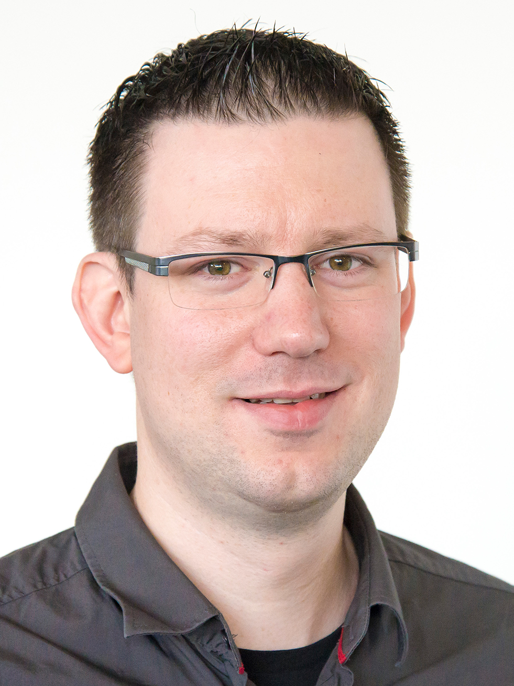

Biografie
==========

Ole Rößner ist seit über 15 Jahren im Web-Umfeld tätig. In dieser Zeit führte sein Weg vorbei an ASP.NET, Java, JavaScript und PHP, aber auch Photoshop, Illustrator und ActionScript sind keine Unbekannten. Der studierte Medieninformatiker arbeitet seit 2011 im team neusta in Bremen als Webentwickler und Coach mit den Schwerpunkten Symfony, Clean Code Development und Agile Arbeitsweisen. Er organisiert interne Weiterbildungen und hilft Kunden dabei, bestehende Anwendungen – oder deren Entwickler – zu modernisieren und qualitativ voranzubringen. Seit Anfang 2019 organisiert er die PHP Usergroup in Bremen.
